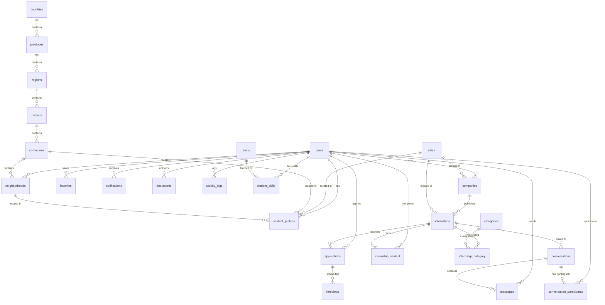

# Base de données — StageLink

## Vue d'ensemble

- **SGBD** : MariaDB (compatible MySQL)
- **Tables** : ~23 tables métier + tables framework
- **Migrations** : ~56 fichiers de migration
- **Soft deletes** : `users`, `companies`, `internships` (colonne `deleted_at`)
- **Schéma géographique** : Hiérarchie complète `Country > Province > Region > District > Commune > Neighborhood`

---

## Schéma complet

### Table `users`

| Colonne | Type | Nullable | Notes |
|---------|------|----------|-------|
| id | bigint unsigned PK | NO | auto-increment |
| name | string | NO | |
| email | string | NO | UNIQUE |
| email_verified_at | timestamp | YES | MustVerifyEmail |
| role | enum('student','company','admin') | NO | default `'student'` |
| firstname | string(100) | YES | |
| lastname | string(100) | YES | |
| status | enum('active','banned','inactive') | NO | default `'active'` |
| password | string | NO | hashed |
| phone | string | YES | |
| avatar | string | YES | |
| banned_at | timestamp | YES | |
| created_at | timestamp | YES | |
| updated_at | timestamp | YES | |
| deleted_at | timestamp | YES | Soft deletes |

### Table `student_profiles`

| Colonne | Type | Nullable | Notes |
|---------|------|----------|-------|
| id | bigint unsigned PK | NO | |
| user_id | FK → users.id | NO | CASCADE |
| phone | string(20) | YES | |
| birth_date | date | YES | |
| gender | enum('male','female','other') | YES | |
| city_id | FK → cities.id | YES | SET NULL |
| commune_id | FK → communes.id | YES | SET NULL |
| neighborhood_id | FK → neighborhoods.id | YES | SET NULL |
| address | text | YES | |
| bio | text | YES | |
| cv_path | string | YES | |
| cv_uploaded_at | timestamp | YES | |
| photo | string | YES | |
| github | string | YES | |
| portfolio | string | YES | |
| linkedin | string | YES | |
| school | string | YES | |
| major | string | YES | |
| diploma | string | YES | |
| current_level | string | YES | |
| graduation_year | integer | YES | |
| study_start | integer | YES | |
| study_end | integer | YES | |
| languages | json | YES | cast: array |
| is_employed | boolean | NO | default `false` |
| job_title | string | YES | |
| employer | string | YES | |
| employed_at | date | YES | |

### Table `companies`

| Colonne | Type | Nullable | Notes |
|---------|------|----------|-------|
| id | bigint unsigned PK | NO | |
| user_id | FK → users.id | NO | CASCADE |
| name | string | NO | |
| description | text | YES | |
| logo | string | YES | |
| website | string | YES | |
| phone | string(20) | YES | |
| location | string | YES | |
| industry | string | YES | |
| status | enum('pending','validated','suspended') | NO | default `'pending'` |
| city_id | FK → cities.id | YES | SET NULL |
| address | text | YES | |
| employees_count | integer | YES | |
| verified_at | timestamp | YES | |
| deleted_at | timestamp | YES | Soft deletes |

### Table `internships`

| Colonne | Type | Nullable | Notes |
|---------|------|----------|-------|
| id | bigint unsigned PK | NO | |
| company_id | FK → companies.id | NO | CASCADE |
| title | string | NO | |
| slug | string(255) | YES | UNIQUE |
| description | text | NO | |
| requirements | text | YES | |
| location | string | YES | |
| type | enum('remote','onsite','hybrid') | NO | default `'onsite'` |
| duration | string | YES | |
| study_level | string(100) | YES | |
| salary | decimal(8,2) | YES | |
| slots | integer | NO | default `1` |
| deadline | date | YES | |
| status | enum('draft','published','closed','expired') | NO | default `'draft'` |
| views_count | integer | NO | default `0` |
| category_id | FK → categories.id | YES | SET NULL |
| city_id | FK → cities.id | YES | SET NULL |
| deleted_at | timestamp | YES | Soft deletes |

### Table `applications`

| Colonne | Type | Nullable | Notes |
|---------|------|----------|-------|
| id | bigint unsigned PK | NO | |
| internship_id | FK → internships.id | NO | CASCADE |
| student_id | FK → users.id | NO | CASCADE |
| cv_path | string | YES | |
| cover_letter | text | YES | |
| cover_letter_path | string | YES | |
| status | enum('pending','accepted','rejected','interview') | NO | default `'pending'` |
| relevance | enum('high','medium','low') | YES | |

---

### Tables de localisation (hiérarchie)

La géographie suit une hiérarchie complète : **Country → Province → Region → District → Commune → Neighborhood**.

| Table | Colonne | Type | FK |
|-------|---------|------|-----|
| `countries` | id | bigint PK | — |
| | name | string | — |
| | iso_code | string | — |
| `provinces` | id | bigint PK | — |
| | country_id | FK → countries.id | CASCADE |
| | name | string | — |
| `regions` | id | bigint PK | — |
| | province_id | FK → provinces.id | CASCADE |
| | name | string | — |
| `districts` | id | bigint PK | — |
| | region_id | FK → regions.id | CASCADE |
| | name | string | — |
| `communes` | id | bigint PK | — |
| | district_id | FK → districts.id | CASCADE |
| | name | string | — |
| `neighborhoods` | id | bigint PK | — |
| | commune_id | FK → communes.id | CASCADE |
| | name | string | — |
| | created_by | FK → users.id | SET NULL |
| | status | enum('pending','approved','rejected') | — |
| | verified | boolean | — |

---

### Tables pivot

#### `student_skills`

| Colonne | Type | Notes |
|---------|------|-------|
| student_id | FK → users.id | |
| skill_id | FK → skills.id | |
| level | string | Débutant, Intermédiaire, Avancé, Expert |
| | UNIQUE(student_id, skill_id) | |

#### `internship_category`

| Colonne | Type | Notes |
|---------|------|-------|
| internship_id | FK → internships.id | |
| category_id | FK → categories.id | |
| | UNIQUE(internship_id, category_id) | |

#### `internship_student`

| Colonne | Type | Notes |
|---------|------|-------|
| internship_id | FK → internships.id | |
| student_id | FK → users.id | |
| start_date | date | |
| end_date | date | |
| status | enum('in_progress','completed','terminated') | |
| feedback | text | |

---

### Autres tables

#### `skills`

| Colonne | Type | Notes |
|---------|------|-------|
| id | bigint PK | |
| name | string | UNIQUE — 113 compétences seedées |

#### `categories`

| Colonne | Type | Notes |
|---------|------|-------|
| id | bigint PK | |
| name | string | |
| slug | string | UNIQUE |

#### `cities`

| Colonne | Type | Notes |
|---------|------|-------|
| id | bigint PK | |
| name | string | |
| province | string | |
| country | string | |

#### `conversations`

| Colonne | Type | Notes |
|---------|------|-------|
| id | bigint PK | |
| internship_id | FK → internships.id | nullable, optional |
| student_id | FK → users.id | |
| company_id | FK → users.id | |

#### `messages`

| Colonne | Type | Notes |
|---------|------|-------|
| id | bigint PK | |
| conversation_id | FK → conversations.id | CASCADE |
| sender_id | FK → users.id | |
| message | text | |
| read_at | timestamp | nullable |
| file_path | string | nullable |
| file_name | string | nullable |
| file_size | integer | nullable |

#### `conversation_participants`

| Colonne | Type | Notes |
|---------|------|-------|
| conversation_id | FK → conversations.id | |
| user_id | FK → users.id | |
| last_read_at | timestamp | |
| | UNIQUE(conversation_id, user_id) | |

#### `interviews`

| Colonne | Type | Notes |
|---------|------|-------|
| id | bigint PK | |
| application_id | FK → applications.id | CASCADE |
| date | datetime | |
| status | enum('scheduled','completed','cancelled') | |
| notes | text | nullable |
| location | string | nullable |
| meeting_link | string | nullable |

#### `notifications`

| Colonne | Type | Notes |
|---------|------|-------|
| id | bigint PK | |
| user_id | FK → users.id | |
| title | string | |
| type | string | |
| message | text | |
| read_at | timestamp | nullable |

#### `favorites`

| Colonne | Type | Notes |
|---------|------|-------|
| student_id | FK → users.id | |
| internship_id | FK → internships.id | |
| | UNIQUE(student_id, internship_id) | |

#### `documents`

| Colonne | Type | Notes |
|---------|------|-------|
| id | bigint PK | |
| user_id | FK → users.id | |
| type | string | |
| path | string | |
| original_name | string | |
| mime_type | string | |
| size | integer | |
| uploaded_at | timestamp | |

#### `activity_logs`

| Colonne | Type | Notes |
|---------|------|-------|
| id | bigint PK | |
| user_id | FK → users.id | nullable |
| action | string | |
| ip_address | string | nullable |
| user_agent | string | nullable |

#### Tables Laravel Framework

| Table | Description |
|-------|-------------|
| `personal_access_tokens` | Sanctum tokens (API auth) |
| `password_reset_tokens` | Tokens de réinitialisation mot de passe |
| `sessions` | Sessions HTTP |
| `cache` | Cache general |
| `cache_locks` | Locks cache |
| `jobs` | Files d'attente jobs |
| `job_batches` | Batches de jobs |
| `failed_jobs` | Jobs échoués |

---

## Diagramme ER (Mermaid)

---

## Relations Eloquent clés

### User
- `hasOne` → StudentProfile
- `hasOne` → Company
- `hasMany` → Application
- `hasMany` → Favorite
- `hasMany` → Notification
- `belongsToMany` → Skill (pivot: `student_skills`, with `level`)
- `belongsToMany` → Conversation (pivot: `conversation_participants`)
- `hasMany` → Document
- `hasMany` → Message
- `hasMany` → ActivityLog

### Company
- `belongsTo` → User
- `hasMany` → Internship
- `belongsTo` → City

### Internship
- `belongsTo` → Company
- `hasMany` → Application
- `belongsToMany` → Category (pivot: `internship_category`)
- `belongsTo` → Category
- `belongsTo` → City
- `belongsToMany` → User (pivot: `internship_student`)

### Application
- `belongsTo` → Internship
- `belongsTo` → User (student)
- `hasMany` → Interview

### Conversation
- `belongsTo` → User (student)
- `belongsTo` → User (company)
- `hasMany` → Message
- `belongsToMany` → User (pivot: `conversation_participants`)

### Message
- `belongsTo` → Conversation
- `belongsTo` → User (sender)

### Skill
- `belongsToMany` → User (pivot: `student_skills`)

### Category
- `belongsToMany` → Internship (pivot: `internship_category`)

---

## Données de seed

| Seed | Description |
|------|-------------|
| `SkillSeeder` | 113 compétences techniques seedées (développement, design, data, etc.) |
| `AdminSeeder` | 1 admin par défaut : `admin@stagelink.mg` / `password` |
| `CitySeeder` | Villes de Madagascar (provinces, régions) |
| `CategorySeeder` | Catégories de stages (Tech, Marketing, Finance, etc.) |
