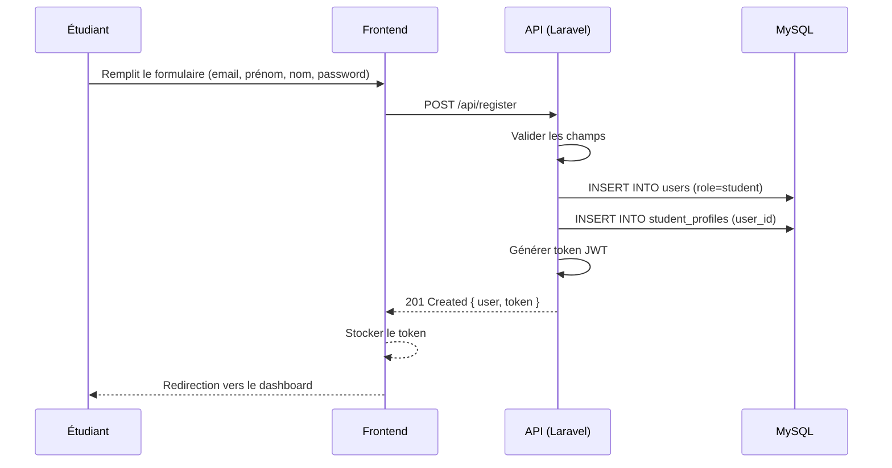
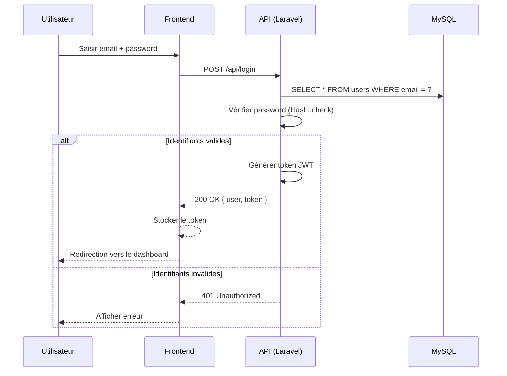
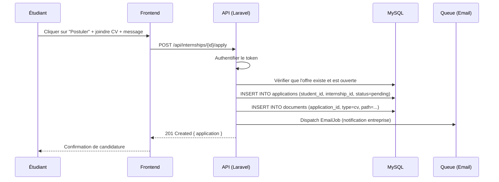
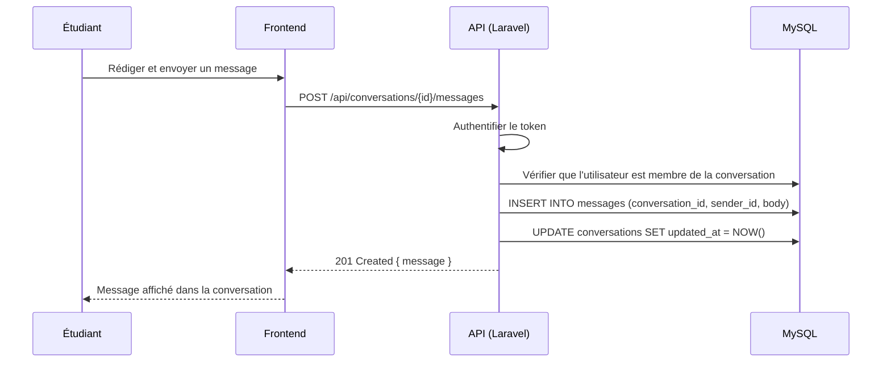
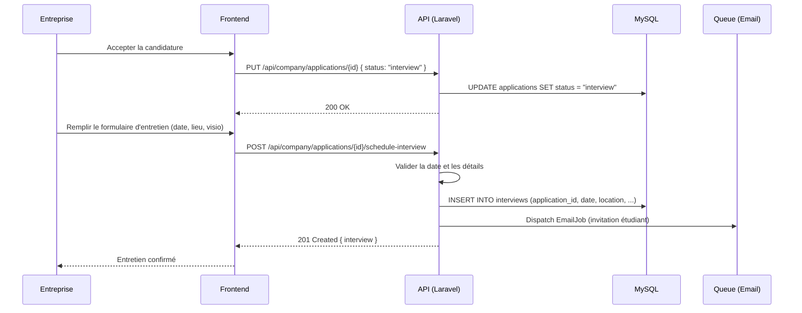
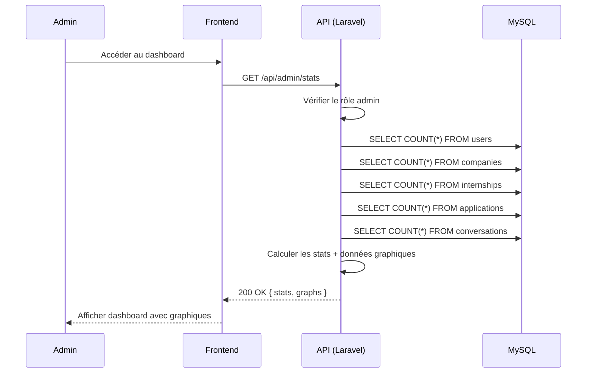

# Diagrammes de séquence — StageLink

> Représentation des flux principaux de l'application StageLink en syntaxe Mermaid.

---

## 1. Inscription étudiant

**Explication** : L'étudiant soumet son formulaire d'inscription. L'API valide les données, crée l'utilisateur avec le rôle `student`, initialise un profil étudiant lié, génère un token JWT et retourne une réponse 201. Le frontend stocke le token et redirige vers le dashboard.

---

## 2. Connexion

**Explication** : L'utilisateur saisit ses identifiants. L'API recherche l'utilisateur par email, vérifie le hash du mot de passe. Si les identifiants sont valides, un token JWT est généré et retourné. Sinon, une erreur 401 est renvoyée.

---

## 3. Postuler à une offre

**Explication** : L'étudiant sélectionne une offre et soumet sa candidature avec un CV et un message. L'API authentifie la requête, vérifie que l'offre est ouverte, crée l'enregistrement de candidature avec le statut `pending`, stocke le document CV et met en file d'attente l'envoi d'un email de notification à l'entreprise.

---

## 4. Messagerie

**Explication** : L'étudiant rédige un message dans une conversation existante. L'API authentifie la requête, vérifie que l'utilisateur est bien membre de la conversation, crée le message et met à jour le champ `updated_at` de la conversation pour refléter l'activité récente.

---

## 5. Programmer un entretien

**Explication** : L'entreprise procède en deux étapes. D'abord, elle met à jour le statut de la candidature à `interview`. Ensuite, elle programme l'entretien en renseignant la date, le lieu ou le lien de visioconférence. Un email d'invitation est envoyé à l'étudiant via la file de jobs.

---

## 6. Dashboard admin

**Explication** : L'administrateur accède au tableau de bord. L'API vérifie que l'utilisateur a bien le rôle `admin`, puis exécute plusieurs requêtes de comptage sur les entités principales (utilisateurs, entreprises, offres, candidatures, conversations). Les statistiques et les données graphiques sont retournées et affichées dans le dashboard.

---

*Dernière mise à jour : Juillet 2026*
